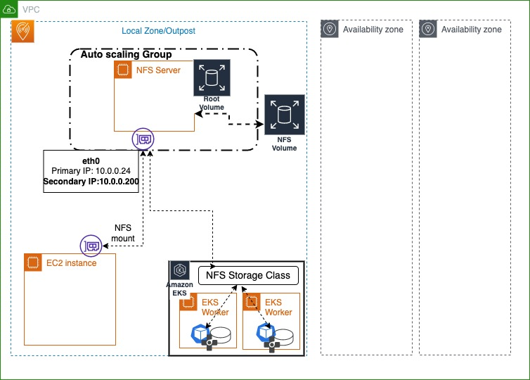

## Resilient File based Storage Solution in LocalZone/Outpost for EKS

## Resilient NFS Storage solution

### Introduction

Amazon EKS utilizes EBS to support (RWO) ReadWriteOnce storage and EFS to support ReadWriteMany (RWX) storage using CSI drivers for their workloads in AWS Regions. 
Similarly for EC2 workloads where a Network Access Storage (Mountable File based storage) is needed, EFS is utilized in region.

LocalZones and outposts have been an essential part of the workloads/solutions which run close to the Edge and customer network. Since localZones and Outposts are smaller, a few services like EFS (Elastic File System) isn't available in LocalZones/Outposts. Sometimes its possible to acccess EFS from the Region over the service link, however the latency, could be a factor for I/O heavy workloads to send and receive the data over network which could have been managed locally.There is a need to offer a resilient, reliable, local Storage which can be  utilized by the EKS workloads as ReadWriteMany Storage, and a Network File system storage for EC2 workloads in the LocalZone.

### Architecture



###  Preparation 

Clone this repo:

```
https://github.com/aws-samples/nfs-solution-localzone-outpost
```

###  Solution

This solution offers a NFS (Network FIle System) based storage system which has following main components:

1. A High Available static secondary IP address (virtual/floating ip), which ensures that clients of this server always have uninterrupted access to the FileServer with same IP address.
2. A secondary EBS volume (acting as File storage directory). NFS clients mount this directory and store their data. This volume is retained even after the stack is deleted, so if there is a need, this volume can be reused. 
3. An AutoScalingGroup, maintaining the Reliability & resilliency for the EC2 node acting as the Network File System. Autoscaling group is launched wth 1 node. 
4. For Kubernetes workloads, nfs-provisioner driver, can be used to provide the ReadWriteMany StorageClass using the HA static IP address of the NFS server.


###  Step 1: Create the NFS Server

Create the nodegroup using CloudFormation provided in this repo. Below are the details on the input parameters of this Node.

    Stack name : Unique name (within that account) to the cloudformation stack , to be created for this solution.

    NFSVolumeSize: This represents volume size in GB for the NFS (used for NFS directory, used to store the data over NFS). Default value is 300, can be modified as per the need.

    VolumeType: This is the volume type for EBS. default value is gp2. Note: gp3 isn't supported in localzone/outpost.

    NodeInstanceType: EC2 instance type. Please select the applicable instance type in the underlying localzone/outpost/az.

    NFSIPAddress: The High Available static virtual/Floating IP addres, used as the single inbound. 

    VpcId: Select the VPC you would like the NFS to be in.

    SubnetId: Select the SubnetID you would like the NFS server to be launched in.

    KeyName: Select  the SSH key-pair (System can also be accessed via SSM)

    NodeImageIdSSMParam : Leave it to the default or change it to the other ID if there is a special need of any other AMI. 


After filling the params, please press next, next and accept the conditions and trigger the stack creation. 
Please wait for the Stack to be completed.

Note: you can find the NodeInstanceRole, NodeSecurityGroupId and NFSVolumeID from the CloudFormation stack output

### Step 2: Check Security group & NFS exports rules

Cloudformation Template adds the Primary VPC CIDR against the NFS protocol in the NFS server security group & in the /etc/exports of the NFS server.
However, secondary VPC CIDRs (if any and used for NFS) needs to be added in the security group of the NFS server against NFS protocol. Also ensure that NFS server /etc/exports is updated with this CIDR. If there is a need to
add another CIDR then it needs to be added in the security group and /etc/exports of NFS server.

Note: In this example 10.0.0.200 is the NFSIPAddress used for NFS.

```
$ showmount -e 10.0.0.200
Export list for 10.0.0.200:
/data 10.0.0.0/16,10.10.0.0/16
$ sudo cat /etc/exports
/data    10.10.0.0/16(rw,sync,no_root_squash,no_all_squash)
/data    10.0.0.0/16(rw,sync,no_root_squash,no_all_squash)
```

Note: NFS uses /data directory on the NFS as the mount directory, can be changed in the cloudfromation template, if needed


### Step 3: Verify the NFS server

In this example, the NFS server created is with following settings:
NFSIPAddress: 10.0.0.200
VolumeType: gp2
NFSVolumeSize: 300

```
$ sudo mkdir /var/backups
$ sudo mount -t nfs 10.0.0.200:/data /var/backups
$ df -kh
Filesystem        Size  Used Avail Use% Mounted on
devtmpfs          482M     0  482M   0% /dev
tmpfs             492M     0  492M   0% /dev/shm
tmpfs             492M  556K  492M   1% /run
tmpfs             492M     0  492M   0% /sys/fs/cgroup
/dev/xvda1         24G   14G   11G  55% /
tmpfs              99M     0   99M   0% /run/user/1000
overlay            24G   14G   11G  55% /var/lib/docker/overlay2/671875ffbbcc032fb81b3f7b5825243d6c1a2c52924582cd12081a1c7f095de6/merged
10.0.0.200:/data  300G  338M  300G   1% /var/backups
```

### Step 4: Insall NFS external privisoner for EKS workloads

Refer the steps at https://github.com/kubernetes-sigs/nfs-subdir-external-provisioner or the below steps. Please replace x.x.x.x with your NFSIPAddress
(ex: 10.0.0.200)  and nfs.path as /data. This creates a storageclass as nfs-client

```
$ helm repo add nfs-subdir-external-provisioner https://kubernetes-sigs.github.io/nfs-subdir-external-provisioner/
$ helm install -n kube-system nfs-subdir-external-provisioner nfs-subdir-external-provisioner/nfs-subdir-external-provisioner \
    --set nfs.server=x.x.x.x \
    --set nfs.path=/exported/path
```

EX:
```

$ helm install -n kube-system nfs-subdir-external-provisioner nfs-subdir-external-provisioner/nfs-subdir-external-provisioner --set nfs.server=10.0.0.200  --set nfs.path=/data
NAME: nfs-subdir-external-provisioner
LAST DEPLOYED: Tue May 24 22:30:57 2022
NAMESPACE: default
STATUS: deployed
REVISION: 1
TEST SUITE: None
$ helm ls
NAME                            NAMESPACE REVISION  UPDATED                                 STATUS    CHART                                   APP VERSION
nfs-subdir-external-provisioner default   1         2022-05-24 22:30:57.956266431 +0000 UTC deployed  nfs-subdir-external-provisioner-4.0.16  4.0.2

$ kubectl -n kube-system get po | grep -i nfs
nfs-subdir-external-provisioner-7d66fbdbb9-t4kc7   1/1     Running             0          24s
$ kubectl -n kube-system get deploy | grep -i nfs
nfs-subdir-external-provisioner   1/1     1            1           39s

$ kubectl get sc
NAME            PROVISIONER                                     RECLAIMPOLICY   VOLUMEBINDINGMODE      ALLOWVOLUMEEXPANSION   AGE
gp2 (default)   kubernetes.io/aws-ebs                           Delete          WaitForFirstConsumer   false                  386d
nfs-client      cluster.local/nfs-subdir-external-provisioner   Delete          Immediate              true                   2m10s
```

### Step 5: Verify the Dynamic provision on NFS

Note: For NFS to work ensure that all worker nodes have nfs-client installed. Ex: 

```
sudo yum install nfs-utils -y
```

```
$ kubectl apply -f test-pvc.yaml
persistentvolumeclaim/test-pvc-claim created
$ kubectl get pvc
NAME             STATUS   VOLUME                                     CAPACITY   ACCESS MODES   STORAGECLASS   AGE
test-pvc-claim   Bound    pvc-455dfdf1-099b-4143-8bb4-4519236076f4   1Mi        RWX            nfs-client     8s
$ kubectl apply -f test-pod.yaml
pod/test-pod created
$ kubectl get po | grep test
test-pod                           1/1     Running             0          25s
$ kubectl exec -it test-pod -- sh
/ # df -kh
Filesystem                Size      Used Available Use% Mounted on
overlay                  20.0G      5.7G     14.3G  28% /
tmpfs                    64.0M         0     64.0M   0% /dev
tmpfs                     7.6G         0      7.6G   0% /sys/fs/cgroup
10.0.0.200:/data/default-test-pvc-claim-pvc-455dfdf1-099b-4143-8bb4-4519236076f4
                        299.9G    338.0M    299.5G   0% /mnt
```


## Cleanup

```
$ kubectl delete pvc test-pvc-claim
persistentvolumeclaim "test-pvc-claim" deleted
$ kubectl delete po test-pod
pod "test-pod" deleted
$ helm uninstall nfs-subdir-external-provisioner
release "nfs-subdir-external-provisioner" uninstalled
$ 
```
Stack can be deleted from the cloudFormation console by selecting the NFS Stack and clicking on Delete.

## Security

See [CONTRIBUTING](CONTRIBUTING.md#security-issue-notifications) for more information.

## License

This library is licensed under the MIT-0 License. See the LICENSE file.
